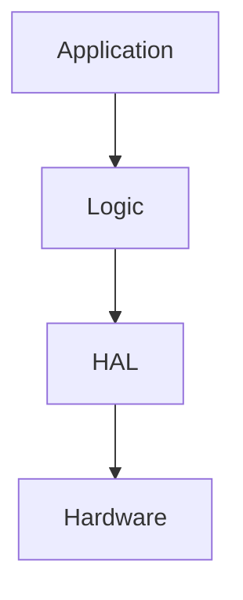

# 🤝 Leitfaden für Code-Beiträge (CONTRIBUTING)

Willkommen beim **GalaxyRVR-Profi-Projekt**!

Dieses Projekt verfolgt einen hohen Standard in Bezug auf Software-Architektur und Dokumentationsqualität.
Unsere Philosophie ist die **doppelte Legitimation**: Der Code muss technisch exzellent (effizient, sicher, deterministisch) sein und gleichzeitig seine Funktionsweise didaktisch klar für Lernende vermitteln.

Bitte lesen Sie diesen Leitfaden sorgfältig durch, bevor Sie einen Pull Request (PR) einreichen.

---

## 1. Architektur-Regeln (Separation of Concerns)

Das Projekt nutzt eine strikte **3-Schichten-Architektur**.
Jeder Beitrag muss eindeutig einer dieser Ebenen zugeordnet werden.
**Verletzungen der Abhängigkeitsrichtung führen zur Ablehnung des PRs.**

### 1.1 Schichtenübersicht

| Schicht          | Verzeichnis      | Zweck & Verantwortung                                      | Erlaubte Abhängigkeiten                                  |
|:-----------------|:-----------------|:-----------------------------------------------------------|:---------------------------------------------------------|
| **1. Application** | `src/main.cpp`   | **Was** passiert wann? (FSM, Setup, Not-Aus).              | Kennt `Logic` & `HAL`.                                   |
| **2. Logic** | `src/logic/`     | **Wie** wird geregelt? (PID, Kinematik, Filter).           | Kennt nur `HAL`. Keine direkten Hardware-Pins nutzen!    |
| **3. HAL** | `src/hal/`       | **Womit** wird gearbeitet? (Treiber, Register, I²C, PWM).  | Kennt niemanden über sich. Keine Logic-Header einbinden! |

### 1.2 Goldene Regel der Abhängigkeit

Code darf nur Module importieren (`#include`), die **architektonisch unter ihm** stehen. Daten fließen von unten nach oben, Befehle von oben nach unten.



-----

## 2\. Coding Guidelines

Wir schreiben Embedded-C++, das deterministisch, lesbar und ressourcenschonend ist.

### 2.1 C++-Standards & Typisierung

  * **Versionierung:**

      * **AVR (Arduino Uno):** C++17
          * *Einschränkung:* Keine STL, kein `std::vector`, kein `new`/`delete` zur Laufzeit (Heap-Fragmentierung vermeiden\!).
      * **ESP32 (XIAO):** C++20
          * *Feature:* STL erlaubt, `std::vector` erlaubt (mit Bedacht).

  * **Strenge Typen:**

      * Nutzen Sie `enum class` für Zustände, um Namenskonflikte zu vermeiden.
      * Vermeiden Sie `#define`-Makros für Konstanten; nutzen Sie stattdessen `constexpr` für Typsicherheit.

**Beispiele:**

🔴 **Schlecht (C-Style Makro):**

```cpp
#define SPEED 100
```

🟢 **Gut (Typsichere Konstante):**

```cpp
constexpr uint8_t CRUISE_SPEED = 100;
```

### 2.2 Zeitverhalten (Non-Blocking I/O)

Die Nutzung von `delay()` ist innerhalb der `loop()` und in Logik-Modulen **streng verboten**.
Das System muss jederzeit reaktionsfähig bleiben (z. B. für Not-Aus-Signale oder Sensor-Updates).

Zeitsteuerung erfolgt ausschließlich über die Messung vergangener Zeit (Delta-Time):

$$ t_{\text{now}} - t_{\text{last}} \ge \Delta t $$

**Richtiges Pattern:**

```cpp
static unsigned long lastExecution = 0;
unsigned long now = millis();

if (now - lastExecution >= INTERVAL_MS) {
    lastExecution = now;
    // ... Aktion durchführen ...
}
```

### 2.3 Dokumentation (Doxygen)

Code ohne Dokumentation existiert für uns nicht.
Wir nutzen Doxygen mit spezifischen Custom-Tags, um technische Zusammenhänge und Sicherheitsaspekte hervorzuheben.

**Pflicht für alle Header-Files (`.h`):**

  * `@brief` – Kurze, prägnante Beschreibung der Klasse/Funktion.
  * `@details` – Ausführliche Erklärung der Algorithmen (gerne mit LaTeX-Formeln für mathematische Hintergründe).
  * `@param` / `@return` – Beschreibung der Ein- und Ausgabewerte.

**Projekt-spezifische Tags (Wichtig):**

Nutzen Sie diese Tags, um Kontext zu schaffen:

  * `@safety` – Beschreibt Sicherheitsmechanismen.
      * *Beispiel:* „Stoppt Motoren sofort bei Verbindungsverlust.“
  * `@hardware` – Listet physische Abhängigkeiten auf.
      * *Beispiel:* „Benötigt Timer1 für PWM-Erzeugung.“
  * `@unit` – Gibt die physikalische Einheit an.
      * *Beispiele:* `m/s`, `PWM (0–255)`, `°/s`, `cm`.

-----

## 3\. Workflow & Git

### 3.1 Commit-Messages

Wir folgen der **Conventional-Commits**-Konvention, um die Git-Historie automatisch auswertbar und lesbar zu halten:

  * `feat(scope): ...`
      * für neue Funktionen (z. B. `feat(hal): add support for QMC6310 compass`)
  * `fix(scope): ...`
      * für Fehlerbehebungen (z. B. `fix(logic): correct PID windup on collision`)
  * `docs: ...`
      * für reine Dokumentationsänderungen
  * `refactor: ...`
      * für Code-Umbau ohne Funktionsänderung (z. B. Variablennamen ändern, Code verschieben)

### 3.2 Pull-Request-Checkliste

Bevor Sie einen PR öffnen, prüfen Sie bitte folgende Punkte:

  - [ ] **Build:** Kompiliert der Code fehlerfrei für **beide** Environments (Uno & ESP32)?
    ```bash
    platformio run -e uno -e xiao_esp32s3
    ```
  - [ ] **Architektur:** Wurde die Schichtentrennung (HAL / Logic / App) eingehalten?
  - [ ] **Doku:** Haben neue Funktionen entsprechende Doxygen-Kommentare inkl. `@safety` / `@unit`-Tags?
  - [ ] **Format:** Wurde der Code formatiert (Clang-Format / CppStyle)?

-----

Vielen Dank, dass Sie dazu beitragen, den GalaxyRVR besser zu machen\! 🚀

