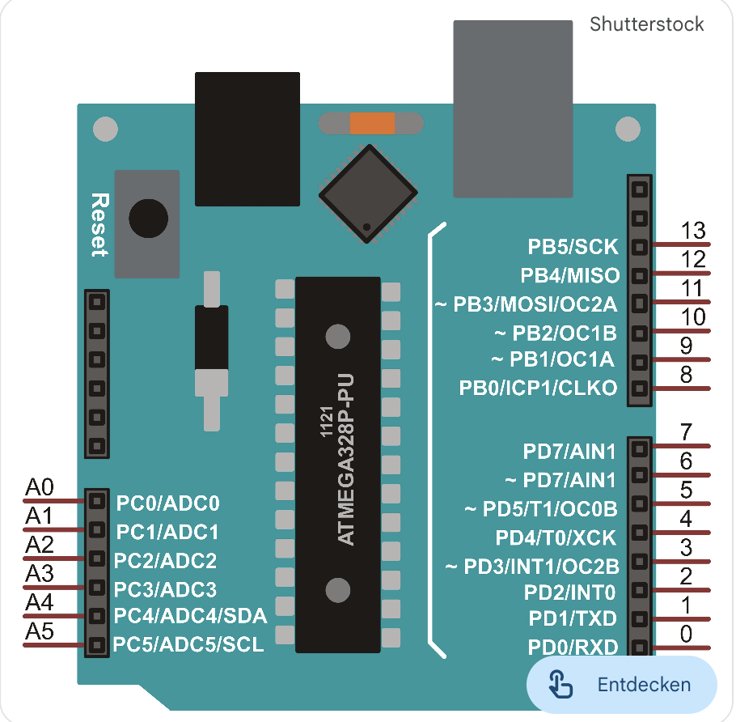

# Technische Spezifikation: Galaxy RVR System

Dieser Überblick fasst die technischen Daten der Hardware-Komponenten sowie die Logik der Pin-Belegung des Galaxy-RVR-Systems zusammen.

---

## 1. Technische Daten der Komponenten

Die Kernkomponenten sind nach ihrer funktionalen Rolle im System gegliedert.

### A. Steuerung & Logik

**SunFounder R3 Board**

- Typ: Arduino-Uno-kompatibles R3-Board
- Mikrocontroller: ATmega328P
- Taktfrequenz: $f = 16\,\mathrm{MHz}$
- Logikspannung: $V_\text{logic} = 5\,\mathrm{V}$
- Rolle: Hauptsteuergerät, führt den C\+\+-Code aus.

**GalaxyRVR Shield**

- Funktion: Aufsteck-Shield als Verteiler und Leistungsebene.
- Features:
  - integrierte Motortreiber (je ein Treiberblock für linke/rechte Seite),
  - Step-Down‐Wandler von Akku ($\approx 6{,}6 \dots 8{,}4\,\mathrm{V}$) auf $5\,\mathrm{V}$,
  - Ports für Motoren (XH2.54-2P), IR-Sensoren, SONAR, RGB-Streifen, Kamera-Servo,
  - Lade- und Batterieanzeige, Power-Schalter.
- Verbindung: Steckt direkt auf dem R3 (Shield-Prinzip).

**ESP32-CAM Modul**

- SoC: ESP32-S (WiFi + Bluetooth).
- Kamera: OV2640, $2\,\mathrm{MP}$.
- Rolle: Video-Streaming (MJPEG-Stream, z.\,B. `http://192.168.4.1:9000/mjpg`) und Brücke zur SunFounder-App.
- Kommunikation zum Arduino: UART über D0/D1; der Mode-Switch trennt die ESP32-CAM beim Upload.

---

### B. Sensorik & Wahrnehmung

**Ultraschallmodul (HC-SR04 oder kompatibel)**

- Reichweite: $2\,\mathrm{cm} \dots 400\,\mathrm{cm}$
- Erfassungswinkel: ca. $15^\circ$
- Funktionsprinzip:
  Die Distanz $d$ ergibt sich aus Laufzeit $t$ und Schallgeschwindigkeit $c \approx 343\,\mathrm{m/s}$:
  \[
  d = \frac{t \cdot c}{2}
  \]
- Anwendung: Hinderniserkennung und Abstandsregelung.

**IR-Hindernisvermeidung (links/rechts)**

- Typ: Infrarot-Reflexionssensor, je ein Modul links/rechts.
- Ausgang: digitales Signal (LOW/HIGH).
- Anwendung: Nahbereichs-Hindernisse und Absturzsicherung an der Fahrzeugkante.

---

### C. Aktorik (Bewegung & Licht)

**TT-Getriebemotoren (6WD)**

- Anzahl: $6$ DC-Getriebemotoren.
- Übersetzung: $i \approx 1:48$
- Betriebsspannung: $3\,\mathrm{V} \dots 6\,\mathrm{V}$
- Besonderheit: Open-Loop-Antrieb ohne Encoder (Geschwindigkeit wird über PWM „geschätzt“).

**Kamera-Servo**

- Typ: Micro-Servo (SG90-Baugröße).
- Stellbereich: typischerweise $0^\circ \dots 180^\circ$ (abhängig von Bibliothek).
- Funktion: Tilt-Mechanismus für Kamera/SONAR-Einheit.

**RGB-LED-Streifen**

- Typ: adressierbare RGB-LED-Streifen (an drei Pins B/R/G geführt).
- Anzahl: zwei Anschlussbuchsen auf dem Shield (elektrisch parallel).
- Anwendung: Unterbodenbeleuchtung und Statusanzeigen.

---

### D. Energieversorgung

**18650-Akkupack**

- Aufbau: zwei Li-Ion-Zellen in Serie.
- Nennspannung:
  \[
  V_\text{sys} \approx 2 \cdot 3{,}7\,\mathrm{V} = 7{,}4\,\mathrm{V}
  \]
- Spannungsbereich: $6{,}6 \dots 8{,}4\,\mathrm{V}$ (entladen ↔ voll).
- Kapazität: typ. $2{,}0 \dots 3{,}0\,\mathrm{Ah}$ je nach Zelltyp.

**Lade- und Power-Pfad (Shield)**

- Battery Port (PH2.0-3P): Eingang für den 2s-18650-Pack (VCC / Middle / GND).
- Charge Port (USB-C): $5\,\mathrm{V} / 2\,\mathrm{A}$ Eingang, Ladedauer ca. $130\,\mathrm{min}$.
- Solar Port (XH2.54-2P): Eingang für Solarpanel; läuft über denselben Ladepfad wie USB.
- Power Switch: schaltet Shield und R3 gemeinsam ein/aus.

**Status-LEDs**

- Charge Indicator (rot): leuchtet beim Laden über USB-C / Solar.
- Power Indicator (grün): Board ist eingeschaltet.
- Battery Indicator (2× orange): zeigen groben Ladezustand; blinken beim Laden und gehen aus, wenn der Akku geladen werden muss.

Hinweis: Diese LEDs hängen direkt am Lade-/Power-IC des Shields und sind **nicht** an Arduino-Pins angebunden. Ein direkter „Ladestatus per Software“ ist ohne Hardware-Modifikation nicht vorgesehen; möglich ist nur eine indirekte Bewertung über die Batteriespannung (Spannungsteiler → Analog-Eingang).

---

## 2. Pin-Belegung: Arduino R3 ↔ GalaxyRVR Shield

Die folgende Tabelle beschreibt das Mapping der Arduino-Pins auf die Funktionen des GalaxyRVR-Shields.

### 2.1 Übersicht Arduino-Pins

| Arduino-Pin | Richtung      | Shield-Funktion                        | Beschreibung |
| :---------- | :------------ | :------------------------------------- | :----------- |
| **D0 (RX)** | Digital In    | UART RX zum ESP32-CAM (über Mode-Switch) | Daten vom ESP32 zum R3. |
| **D1 (TX)** | Digital Out   | UART TX zum ESP32-CAM (über Mode-Switch) | Daten vom R3 zum ESP32. |
| **D2**      | Digital/PWM   | Motor Port (Left) – Eingang 1          | Richtung/Antrieb links (Treiber AIN1). |
| **D3**      | Digital/PWM   | Motor Port (Left) – Eingang 2          | Richtung/Antrieb links (Treiber AIN2). |
| **D4**      | Digital/PWM   | Motor Port (Right) – Eingang 1         | Richtung/Antrieb rechts (Treiber BIN1). |
| **D5**      | Digital/PWM   | Motor Port (Right) – Eingang 2         | Richtung/Antrieb rechts (Treiber BIN2). |
| **D6**      | PWM           | Kamera-Servo („I6“)                    | PWM-Signal zum Tilt-Servo. |
| **D7**      | Digital In    | IR RIGHT                               | Hinderniserkennung rechts. |
| **D8**      | Digital In    | IR LEFT                                | Hinderniserkennung links. |
| **D9**      | –             | (auf Shield ungenutzt)                 | frei für eigene Erweiterungen. |
| **D10**     | Digital       | SONAR Trig + Echo                      | Trig und Echo gemeinsam auf D10 geführt. |
| **D11**     | Digital Out   | RGB Strip – Blau (B)                   | Datenleitung Blau-Kanal. |
| **D12**     | Digital Out   | RGB Strip – Rot (R)                    | Datenleitung Rot-Kanal. |
| **D13**     | Digital Out   | RGB Strip – Grün (G)                   | Datenleitung Grün-Kanal. |
| **A0**      | Analog / D14  | Servo-/Signal-Header (unterste Reihe)  | frei nutzbarer Signalpin. |
| **A1**      | Analog / D15  | Servo-/Signal-Header (3. Reihe)        | frei nutzbarer Signalpin. |
| **A2**      | Analog / D16  | Servo-/Signal-Header (2. Reihe)        | frei nutzbarer Signalpin. |
| **A3–A5**   | Analog / D17–D19 | Standard-Arduino-Header             | für eigene Sensoren (z.\,B. Batteriemessung). |

Die übrigen Standard-Pins des R3 (AREF, 5V, 3V3, GND etc.) bleiben wie beim Arduino Uno verfügbar.

### 2.2 Mode Switch (ESP32-CAM / Upload)

Der Mode-Schalter auf dem Shield schaltet die Verbindung der ESP32-CAM zu D0/D1 um:

- Schalter **rechts**: ESP32-CAM getrennt → D0/D1 nur für USB-Programmier-Interface des R3 nutzbar (Sketch-Upload, Serial-Monitor).
- Schalter **links**: ESP32-CAM verbunden → R3 und ESP32 teilen sich D0/D1 für die Laufzeitkommunikation.

Beim Flashen des Arduino-Sketches: Schalter nach rechts.
Für normalen Kfz-Betrieb mit Kamera: Schalter nach links.

---

## 3. Stecker-Details (Shield-Konnektoren)

### 3.1 SONAR – ZH1.5-4P

| Pin | Signal | Arduino-Pin | Beschreibung                       |
| :-- | :----- | :---------- | :--------------------------------- |
| 1   | 5V     | –           | Versorgung Ultraschallmodul        |
| 2   | D10    | D10         | Trig                               |
| 3   | D10    | D10         | Echo (intern mit Trig gebrückt)    |
| 4   | GND    | –           | Masse                              |

Hinweis: Da Trig und Echo denselben Pin verwenden, muss die Software den Pin umschalten (Ausgang → Trigimpuls, Eingang → Echozeit messen).

---

### 3.2 CAMERA – ZH1.5-5P (ESP32-CAM-Adapter)

| Pin | Signal | Arduino-Pin |
| :-- | :----- | :---------- |
| 1   | GND    | –           |
| 2   | 5V     | –           |
| 3   | RXD    | D0 (RX)     |
| 4   | TXD    | D1 (TX)     |
| 5   | RESET  | RESET       |

---

### 3.3 IR LEFT / IR RIGHT – je ZH1.5-3P

**IR LEFT**

| Pin | Signal | Arduino-Pin |
| :-- | :----- | :---------- |
| 1   | GND    | –           |
| 2   | 5V     | –           |
| 3   | SIG    | D8          |

**IR RIGHT**

| Pin | Signal | Arduino-Pin |
| :-- | :----- | :---------- |
| 1   | GND    | –           |
| 2   | 5V     | –           |
| 3   | SIG    | D7          |

---

### 3.4 RGB Strip – zwei parallele ZH1.5-4P

Je Anschluss:

| Pin | Signal | Arduino-Pin |
| :-- | :----- | :---------- |
| 1   | 5V     | –           |
| 2   | B      | D11         |
| 3   | R      | D12         |
| 4   | G      | D13         |

Beide Buchsen sind elektrisch parallel; es können zwei Streifen mit identischer Belegung betrieben werden.

---

### 3.5 Motor Ports – XH2.54-2P

- Obere 3 Buchsen: **Motor Port (Left)** → alle hängen an demselben Treiberblock (Pins D2/D3).
- Untere 3 Buchsen: **Motor Port (Right)** → alle hängen an einem zweiten Treiberblock (Pins D4/D5).

Pro Motor:

- 2 Leitungen zum DC-Motor, Richtung und Bremsen werden durch das Ansteuern von D2/D3 bzw. D4/D5 bestimmt (z.\,B. über `analogWrite`/`digitalWrite`).

---

### 3.6 Kamera-Servo / A0–A2 / I6-Header (2×4)

Der 8-polige Header ist in vier Reihen (von unten nach oben) organisiert, jeweils mit:

- links: GND (schwarz),
- Mitte: 5V (rot),
- rechts: Signal (gelb).

| Reihe (von unten) | Signal-Pin | Funktion                         |
| :---------------- | :--------- | :------------------------------- |
| 1 (unten)         | A0         | universeller Signal-/Servo-Pin   |
| 2                 | A1         | universeller Signal-/Servo-Pin   |
| 3                 | A2         | universeller Signal-/Servo-Pin   |
| 4 (oben)          | D6 („I6“)  | Servo für Kamera-Tilt (Standard) |

Servo-Farbzuordnung:

- Braun → GND (`-`)
- Rot → 5V (`+`)
- Gelb → Signal (z.\,B. D6)

---

## 4. Architektur-Zusammenfassung

### 4.1 Signalfluss

1. Die SunFounder-App oder Weboberfläche sendet Fahr- und Kamera-Befehle per WLAN an die **ESP32-CAM**.
2. Die ESP32-CAM dekodiert diese Befehle und gibt sie über UART (D0/D1) an den **Arduino R3** weiter.
3. Der Arduino führt die Fahrlogik aus und steuert die Aktoren (Motoren, Servo, RGB-Streifen) über das GalaxyRVR-Shield.
4. Sensoren (IR, SONAR) melden Hindernisse und Abstände an den Arduino zurück.

### 4.2 Stromfluss

1. Zwei 18650-Zellen liefern $V_\text{sys} \approx 7{,}4\,\mathrm{V}$ an den Battery-Port des Shields.
2. Das Shield speist:
   - die **Motortreiber** weitgehend direkt aus dem Akku (High-Current-Pfad),
   - die **Logik-Schiene** (Arduino, ESP32-CAM, Sensoren, LED-Streifen) über einen Step-Down-Regler auf $5\,\mathrm{V}$.
3. Zusätzliche Energie kann über USB-C oder das Solarpanel in den Akku nachgeladen werden; der Lade-IC regelt Ladestrom und LED-Status.

---
