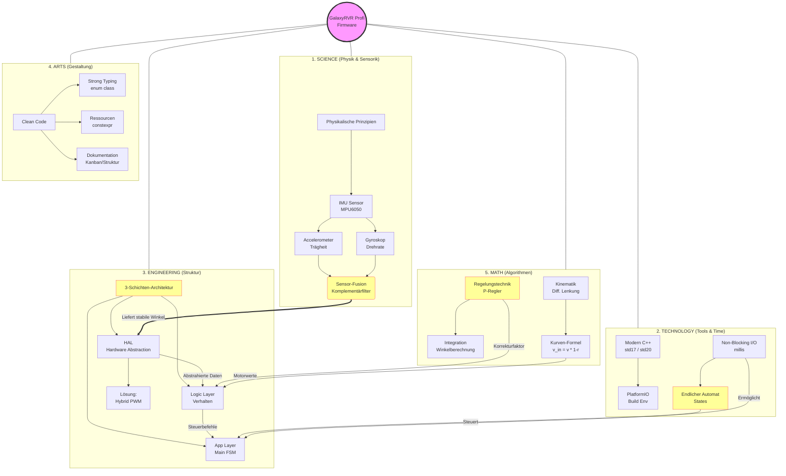

# 🗺️ Concept Map: Wissensvernetzung

### Visualisierung (Mermaid Diagramm)

-----

### Erläuterung der Zusammenhänge

1.  **Von der Physik zum Code (Science $\rightarrow$ Engineering):**
    Die physikalischen Sensoren (IMU) liefern rohe, verrauschte Daten. Erst die **Sensor-Fusion** (Science) macht daraus nutzbare Daten, die im **HAL** (Engineering) gekapselt werden.

2.  **Von der Mathematik zur Bewegung (Math $\rightarrow$ Logic):**
    Der **Logic Layer** bedient sich mathematischer Konzepte. Der **P-Regler** und die **Kinematik-Formeln** sind die "Gehirnmasse", die entscheidet, wie schnell sich ein Rad drehen muss.

3.  **Vom Tool zur Struktur (Tech $\rightarrow$ App):**
    Ohne das technologische Konzept des **Non-Blocking I/O** (Vermeidung von `delay`) wäre der komplexe **Endliche Automat (FSM)** in der Application-Layer gar nicht möglich. Der Roboter würde sonst während einer Wartezeit "einfrieren".

4.  **Die Form hält alles zusammen (Arts):**
    Damit diese Komplexität handhabbar bleibt, sorgen **Clean Code** und **Dokumentation** dafür, dass Menschen den Code verstehen und warten können.

