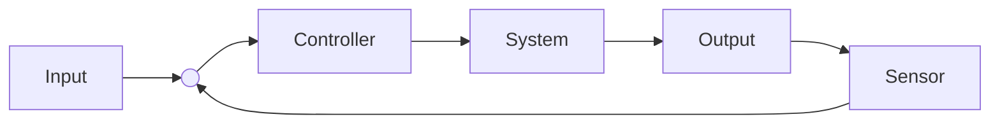

# Entwicklungskonzept: GalaxyRVR Evolution

Das Konzept baut auf der bestehenden 3-Schichten-Architektur (`HAL`, `Logic`, `App`) auf und nutzt die Stärken der beiden Plattformen (Arduino für Echtzeit-Regelung, ESP32 für High-Level-Tasks).

## Phase 1: Präzision & Orientierung (Math & Physics)
**Ziel:** Der Rover soll nicht nur fahren, sondern wissen, *wo* er ist (Odometrie) und noch präziser regeln.

### 1.1 Vom P-Regler zum PID-Regler
Aktuell nutzt der `DriveAssistant` einen **P-Regler** (Proportional). Um Oszillationen bei hohen Geschwindigkeiten zu minimieren und statische Fehler (z. B. leichte Schräglage auf Teppich) auszugleichen, wird der **I-Anteil (Integral)** und **D-Anteil (Derivative)** ergänzt.

* **Mathematik:**
    $$u(t) = K_p \cdot e(t) + K_i \int e(t) \, dt + K_d \frac{de(t)}{dt}$$
* **Implementierung:** Erweiterung in `src/logic/DriveAssistant.cpp`.
* **Lernziel:** Verstehen, wie der D-Anteil "in die Zukunft schaut" (Bremsen, bevor man das Ziel kreuzt) und der I-Anteil "Vergangenheit repariert" (Restfehler beseitigen).

PID controller block diagram feedback loop

### 1.2 Koppelnavigation (Dead Reckoning)
Der Rover soll seine Position $(x, y)$ im Raum schätzen. Da wir keine Encoder an den Rädern haben, nutzen wir ein physikalisches Modell basierend auf Zeit und Geschwindigkeit (aus PWM geschätzt) sowie dem Gyroskop-Winkel $\theta$.

* **Mathematik (in jedem Zeitschritt $\Delta t$):**
    $$x_{neu} = x_{alt} + v \cdot \cos(\theta) \cdot \Delta t$$
    $$y_{neu} = y_{alt} + v \cdot \sin(\theta) \cdot \Delta t$$
* **Architektur:** Neue Klasse `Odometry` in `src/logic/`.
* **Feature:** Der Rover kann angewiesen werden: "Fahre 1 Meter vor und komm zurück zum Startpunkt $(0,0)$".

---

## Phase 2: Umgebungsinteraktion (Science & Logic)
**Ziel:** Statt Hindernissen nur auszuweichen, soll der Rover mit ihnen interagieren (z. B. Wänden folgen).

### 2.1 Wandverfolgung (Wall Following)
Nutzung des Ultraschallsensors (drehbar oder seitlich montiert) oder IR-Sensoren, um parallel zu einer Wand zu fahren.

* **Logik:** Ein Regelkreis versucht, den Abstand $d$ konstant auf z. B. 20 cm zu halten.
    * $d < 20$: Lenke leicht weg.
    * $d > 20$: Lenke leicht hin.
* **Anwendung:** Labyrinth-Lösung (Rechte-Hand-Regel).

### 2.2 Absturz-Sicherung (Cliff Detection)
Integration der IR-Sensoren unter dem Chassis (normalerweise für Linienverfolgung).
* **HAL-Erweiterung:** `IrSensor` Klasse liest Boden-Reflektion.
* **FSM-Erweiterung:** Neuer State `EMERGENCY_STOP`, wenn IR-Sensoren "schwarz" (kein Boden / Abgrund) melden. Schützt den Rover auf Tischen.

---

## Phase 3: Konnektivität & IoT (Tech - Fokus ESP32)
**Ziel:** Fernüberwachung und Steuerung ohne Kabel. Da der ESP32 WiFi besitzt, ist dies der ideale "Profi"-Schritt.

### 3.1 Web-Telemetrie Dashboard
Der Rover spannt einen WLAN-Hotspot auf und hostet eine kleine Website.
* **Funktion:** Echtzeit-Anzeige von:
    * Batteriespannung
    * Aktueller Neigung (Pitch/Roll)
    * Geschätzter Position $(x,y)$
* **Technik:** `AsyncWebServer` Bibliothek auf dem ESP32. Datenaustausch via JSON.

### 3.2 Over-the-Air (OTA) Updates
Nie wieder USB-Kabel anschließen, um eine Variable im Code zu ändern. Neue Firmware wird per WLAN hochgeladen.

---

## Phase 4: Intelligentes Verhalten (Algorithms)
**Ziel:** Komplexe Aufgaben lösen durch Kombination der vorherigen Phasen.

### 4.1 Mapping (Gitter-Karte)
Der Rover unterteilt die Welt in ein virtuelles Raster (Grid).
* **Logik:**
    1.  Fahre zu Rasterzelle.
    2.  Messe mit Ultraschall.
    3.  Trage in Array ein: `0 = Frei`, `1 = Hindernis`.
* **Visualisierung:** Ausgabe der Karte auf dem Web-Dashboard (Phase 3).

### 4.2 Missions-Planer (Command Queue)
Anstatt nur *einen* Zustand zu haben, erhält der Rover eine Liste von Befehlen.
* **Struktur:** `std::queue<Command> mission;`
* **Beispiel-Mission:**
    1.  `DRIVE_FORWARD(100 cm)`
    2.  `TURN(90 degrees)`
    3.  `SCAN_ENV()`
    4.  `RETURN_HOME()`

---

## Roadmap

| Phase | Fokus | Neue Hardware nötig? | Haupt-Lernfeld |
| :--- | :--- | :--- | :--- |
| **1. Präzision** | PID, Odometrie | Nein | Mathematik, Regelungstechnik |
| **2. Interaktion** | Wall Follow, Cliff | Nein (IR nutzen) | Algorithmen, Logik |
| **3. IoT (ESP32)** | Telemetrie, OTA | Nein (nur ESP32) | Netzwerktechnik, Web-Dev |
| **4. Autonomie** | Mapping, Missionen | Optional (besserer US-Sensor) | Datenstrukturen, KI-Grundlagen |

