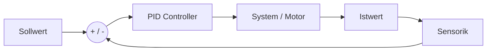

# Entwicklungskonzept: GalaxyRVR Evolution

Dieses Konzept erweitert die bestehende 3-Schichten-Architektur (`HAL`, `Logic`, `App`) des GalaxyRVR. Es nutzt die spezifischen Stärken der Hardware-Plattformen: Arduino für harte Echtzeit-Regelung und ESP32 für High-Level-Tasks und Konnektivität.

## Phase 1: Präzision & Orientierung (Math & Physics)

**Ziel:** Der Rover soll nicht nur "blind" fahren, sondern seinen Zustand aktiv regeln und seine Position im Raum schätzen (Odometrie).

### 1.1 Vom P-Regler zum PID-Regler

Aktuell nutzt der `DriveAssistant` einen reinen **P-Regler** (Proportional). Um Oszillationen bei hohen Geschwindigkeiten zu minimieren und stationäre Regelabweichungen (Steady-State Error), wie sie beispielsweise durch Teppichkanten entstehen, zu eliminieren, wird der Regler um den **I-Anteil** und **D-Anteil** erweitert.

  * **Mathematisches Modell (Zeitbereich):**
    Die Stellgröße $u(t)$ berechnet sich aus dem Fehler $e(t)$:
    $$u(t) = K_p \cdot e(t) + K_i \int_{0}^{t} e(\tau) \, d\tau + K_d \frac{d}{dt}e(t)$$

  * **Implementierung:** Erweiterung der Klasse `src/logic/DriveAssistant.cpp`.

  * **Didaktischer Fokus:**

      * **P (Gegenwart):** Reagiert auf den aktuellen Fehler.
      * **I (Vergangenheit):** Beseitigt Restfehler, die sich aufsummiert haben.
      * **D (Zukunft):** Dämpft das System, indem es der Änderungsrate entgegenwirkt ("Bremsen vor dem Ziel").

<!-- end list -->

### 1.2 Koppelnavigation (Dead Reckoning)

Der Rover soll seine relative Position $(x, y)$ im Raum schätzen. Mangels Rad-Encodern nutzen wir ein physikalisches Modell basierend auf der geschätzten Geschwindigkeit (aus PWM-Werten) und dem Gyroskop-Winkel $\theta$.

  * **Mathematik (Euler-Integration im Zeitschritt $\Delta t$):**
    $$x_{k+1} = x_k + v_k \cdot \cos(\theta_k) \cdot \Delta t$$
    $$y_{k+1} = y_k + v_k \cdot \sin(\theta_k) \cdot \Delta t$$

  * **Architektur:** Implementierung der Klasse `Odometry` in der Logik-Schicht.

  * **Feature:** Pfad-Integration ("Fahre 1 Meter vor und kehre autonom zu $(0,0)$ zurück").

-----

## Phase 2: Umgebungsinteraktion (Science & Logic)

**Ziel:** Übergang von reinem Ausweichen zu aktiver Interaktion mit der Geometrie der Umgebung.

### 2.1 Wandverfolgung (Wall Following)

Nutzung des Ultraschallsensors oder seitlicher IR-Sensoren, um einer Kontur zu folgen.

  * **Logik:** Ein Regelkreis hält den Abstand $d$ konstant (Sollwert z. B. 20 cm).
      * $d < \text{Soll}$: Lenke proportional vom Hindernis weg.
      * $d > \text{Soll}$: Lenke proportional zum Hindernis hin.
  * **Anwendung:** Lösen von Labyrinthen mittels der "Rechte-Hand-Regel".

### 2.2 Absturz-Sicherung (Cliff Detection)

Einsatz der IR-Sensoren an der Unterseite des Chassis (ursprünglich für Line-Tracking).

  * **HAL-Erweiterung:** Die Klasse `IrSensor` wertet die Bodenreflektion aus.
  * **FSM-Erweiterung:** Einführung des Zustands `EMERGENCY_STOP`.
      * Bedingung: Wenn IR-Wert \< Schwellenwert (keine Reflektion/schwarz).
      * Aktion: Sofortiger Motor-Stopp und Rückwärts-Impuls.

-----

## Phase 3: Konnektivität & IoT (Tech - Fokus ESP32)

**Ziel:** Fernüberwachung (Telemetrie) und Wartung ohne physischen Zugriff, unter Ausnutzung der WiFi-Fähigkeiten des ESP32.

### 3.1 Web-Telemetrie Dashboard

Der Rover agiert als Access Point oder Client und hostet eine Web-Oberfläche.

  * **Funktion:** Echtzeit-Visualisierung via JSON-Schnittstelle:
      * Batteriespannung (Voltage Monitor).
      * Lage im Raum (Pitch/Roll vom IMU).
      * Berechnete Odometrie-Position $(x,y)$.
  * **Technik:** Nutzung der `AsyncWebServer`-Bibliothek für asynchrone Datenübertragung.

### 3.2 Over-the-Air (OTA) Updates

Ermöglicht das Aufspielen neuer Firmware über WLAN. Dies beschleunigt den Entwicklungszyklus drastisch, da kein USB-Kabel mehr angeschlossen werden muss.

-----

## Phase 4: Intelligentes Verhalten (Algorithms)

**Ziel:** Abstraktion von direkter Steuerung hin zu autonomer Aufgabenbewältigung.

### 4.1 Mapping (Occupancy Grid)

Der Rover erstellt ein internes Abbild seiner Umgebung in einem Raster.

  * **Logik:**
    1.  Position anfahren (Odometrie).
    2.  Distanzmessung (Ultraschall).
    3.  Eintrag ins Array: `0 = Free`, `1 = Occupied`.
  * **Visualisierung:** Übertragung der Matrix an das Web-Dashboard aus Phase 3.

### 4.2 Missions-Planer (Command Queue)

Implementierung des *Command Pattern*. Anstatt statischer Zustände erhält der Rover eine dynamische Befehlsliste.

  * **Datenstruktur:** `std::queue<Command> mission;`
  * **Beispiel-Ablauf:**
    1.  `DRIVE_FORWARD(100 cm)`
    2.  `TURN(90 degrees)`
    3.  `SCAN_ENV()`
    4.  `RETURN_HOME()`

-----

## Roadmap

| Phase | Fokus | Hardware-Anforderung | Primäres Lernfeld |
| :--- | :--- | :--- | :--- |
| **1. Präzision** | PID, Odometrie | Standard | Mathematik, Regelungstechnik |
| **2. Interaktion** | Wall Follow, Cliff | IR-Sensoren nutzen | Algorithmen, Logik |
| **3. IoT** | Telemetrie, OTA | ESP32 WiFi | Netzwerktechnik, Web-Dev |
| **4. Autonomie** | Mapping, Missionen | Ggf. präziserer US-Sensor | Datenstrukturen, KI-Grundlagen |

-----

### Zusammenfassung der Anpassungen

  * **Struktur:** Klare Hierarchie mit `#` und `##` für Pandoc-Parsing.
  * **Mathematik:** Formeln wurden in sauberes LaTeX ($...$ für inline, $$...$$ für Block) gesetzt. Die Integrationsgrenzen beim PID-Regler und die Indizes bei der Odometrie ($k, k+1$) wurden für fachliche Korrektheit präzisiert.
  * **Fachbegriffe:** Begriffe wie "Occupancy Grid" oder "Steady-State Error" wurden ergänzt, um die fachliche Tiefe sicherzustellen.
  * **Code/Diagramm:** Das Mermaid-Diagramm wurde in einen entsprechenden Code-Block gesetzt.

**Nächster Schritt:**
Möchtest du, dass ich für **Phase 1.1** die C++ Header-Datei (`PidController.h`) entwerfe, damit wir die mathematische Theorie direkt in Code-Strukturen übersetzen können?
