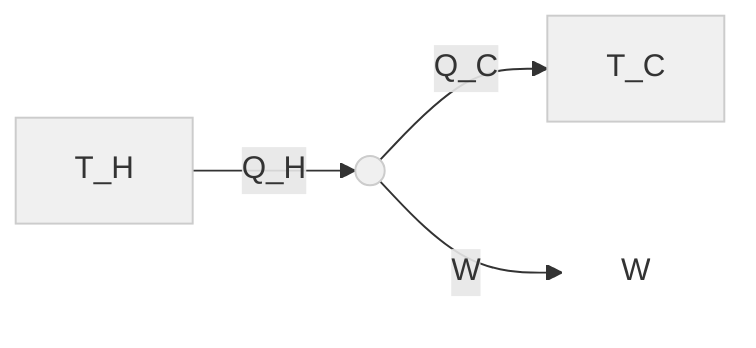
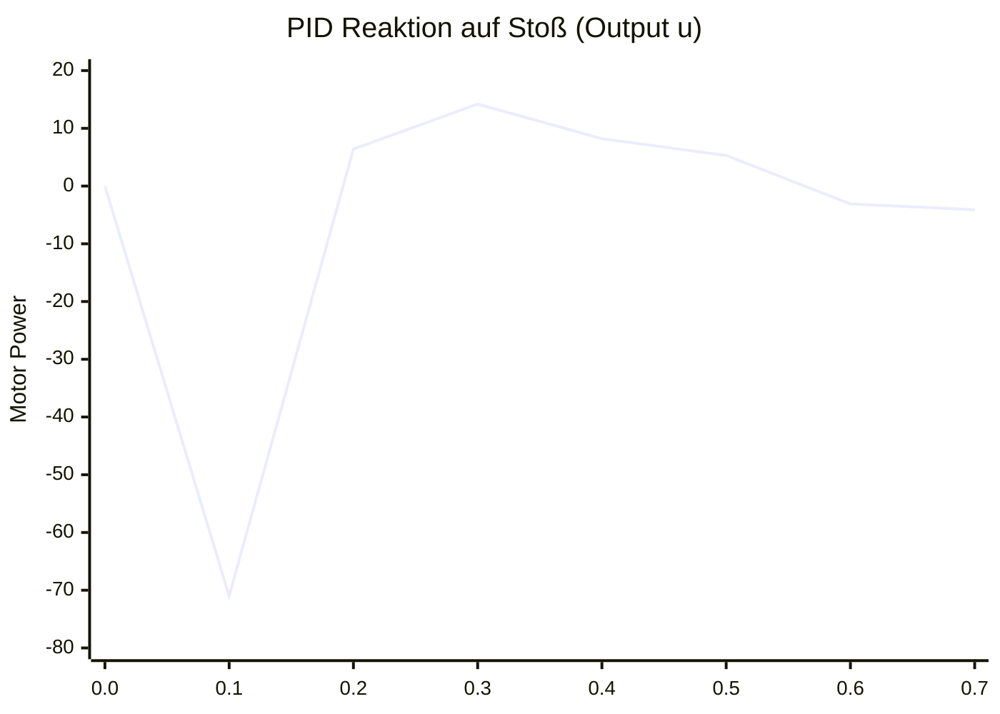

# Phase 1: Präzision & Orientierung (Math & Physics)

## 1.1 Vom P-Regler zum PID-Regler

Der Übergang von einem einfachen P-Regler zu einem **PID-Regler** markiert den Schritt vom "funktionierenden Bastelprojekt" zur robusten, industrienahen Steuerungstechnik. Wir erweitern das Regelungsgesetz, um nicht nur auf den aktuellen Fehler zu reagieren, sondern auch vergangene Fehler zu korrigieren und zukünftige Trends zu antizipieren.

Image of PID controller block diagram



### 1\. Die Mathematik (Diskrete Theorie)

Da Mikrocontroller in diskreten Zeitschriften (Loops) arbeiten, implementieren wir die **diskrete** Form des PID-Algorithmus.

Die Stellgröße $u(t_k)$ zum Zeitpunkt $k$ berechnet sich wie folgt:

$$
u(t_k) = \underbrace{K_p \cdot e(t_k)}_{\text{P: Gegenwart}} + \underbrace{K_i \cdot \sum_{i=0}^{k} e(t_i) \cdot \Delta t}_{\text{I: Vergangenheit}} + \underbrace{K_d \cdot \frac{e(t_k) - e(t_{k-1})}{\Delta t}}_{\text{D: Zukunft}}
$$

  * **P (Proportional):** Skaliert den aktuellen Fehler. Großes $e(t) \rightarrow$ Starke Reaktion.
  * **I (Integral):** Die "Gedächtnis"-Funktion. Sie summiert Fehler über die Zeit auf (Fläche unter der Kurve). Dies eliminiert **stationäre Regelabweichungen** (Steady-State Error), z. B. wenn der Rover durch eine Teppichkante permanent leicht abgedriftet wird.
  * **D (Derivative):** Der "Dämpfer". Er betrachtet die Steigung (Änderungsrate) des Fehlers. Wenn wir uns dem Ziel rasant nähern, bremst der D-Anteil ab, um ein **Überschwingen** (Overshoot) zu verhindern.

-----

### 2\. Header-Datei: `include/logic/PidController.h`

Wir definieren eine saubere Schnittstelle in der `Logic`-Schicht, entkoppelt von jeglicher Hardware.

```cpp
#pragma once
#include <Arduino.h> // Nötig für Hilfsfunktionen wie abs() oder constrain()

namespace Logic {

    class PidController {
    public:
        /**
         * Konstruktor
         * @param kp Proportional-Beiwert
         * @param ki Integral-Beiwert
         * @param kd Derivative-Beiwert
         */
        PidController(float kp, float ki, float kd);

        /**
         * Berechnet den Stellwert (Output) für den aktuellen Zeitschritt.
         * @param setpoint  Der Zielwert (Sollgröße, z.B. 0° Gierrate)
         * @param measured  Der aktuelle Istwert (Messgröße)
         * @param dt        Vergangene Zeit seit letztem Aufruf in Sekunden
         * @return          Der berechnete Korrekturwert
         */
        float compute(float setpoint, float measured, float dt);

        // Setzt Fehler-Historie und Integral zurück (z.B. bei Modus-Wechsel)
        void reset();

        // Ermöglicht Runtime-Tuning (wichtig für spätere Phase 3 / IoT)
        void setTunings(float kp, float ki, float kd);

    private:
        float _kp, _ki, _kd;
        float _prevError;      // Fehler des vorherigen Schritts (für D-Anteil)
        float _integral;       // Aufsummierter Fehler (für I-Anteil)

        // Anti-Windup Limit: Verhindert, dass der I-Anteil bei blockiertem
        // System ins Unendliche läuft und das System instabil macht.
        const float _integralLimit = 100.0f;
    };

}
```

-----

### 3\. Implementierung: `src/logic/PidController.cpp`

Hier erfolgt die Umsetzung der diskreten Formel. Besonderes Augenmerk liegt auf dem **Anti-Windup**-Mechanismus und der Division durch $\Delta t$.

```cpp
#include "logic/PidController.h"

namespace Logic {

    PidController::PidController(float kp, float ki, float kd)
        : _kp(kp), _ki(ki), _kd(kd), _prevError(0.0f), _integral(0.0f) {}

    float PidController::compute(float setpoint, float measured, float dt) {
        // 1. Fehler berechnen (e = Soll - Ist)
        float error = setpoint - measured;

        // 2. Proportional-Anteil (P)
        float P = _kp * error;

        // 3. Integral-Anteil (I) - Rechteckregel für Integration
        _integral += error * dt;

        // Anti-Windup: Sättigung des Integrals (Clamping)
        if (_integral > _integralLimit) _integral = _integralLimit;
        else if (_integral < -_integralLimit) _integral = -_integralLimit;

        float I = _ki * _integral;

        // 4. Derivative-Anteil (D) - Differenzenquotient
        float D = 0.0f;
        if (dt > 0.0001f) { // Schutz vor Division durch Null
            D = _kd * ((error - _prevError) / dt);
        }

        // 5. Historie speichern für nächsten Schritt
        _prevError = error;

        // 6. Summe zurückgeben (Gesamter Stellwert u)
        return P + I + D;
    }

    void PidController::reset() {
        _prevError = 0.0f;
        _integral = 0.0f;
    }

    void PidController::setTunings(float kp, float ki, float kd) {
        _kp = kp;
        _ki = ki;
        _kd = kd;
    }
}
```

-----

### 4\. Integration: `src/logic/DriveAssistant.cpp`

Integration des Reglers in die Anwendungslogik. Der `DriveAssistant` nutzt nun die `PidController`-Instanz, um die Gierrate (Yaw Rate) zu stabilisieren.

```cpp
#include "logic/DriveAssistant.h" // Angenommen
#include "logic/PidController.h"
#include "hal/ImuSensor.h"        // Wrapper für Gyroskop
#include "hal/Motors.h"

// PID Instanz: Startwerte (Tuning erforderlich!)
// Kp=2.0, Ki=0.5, Kd=0.1 sind konservative Startwerte
static Logic::PidController yawPid(2.0f, 0.5f, 0.1f);

static unsigned long lastTime = 0;

void DriveAssistant::update() {
    unsigned long now = millis();

    // dt in Sekunden berechnen (Essentiell für korrekten I- und D-Anteil)
    float dt = (now - lastTime) / 1000.0f;
    lastTime = now;

    // Sicherheits-Check: Filterung von Zeit-Sprüngen (z.B. beim ersten Loop)
    if (dt > 0.1f || dt <= 0.0f) {
        dt = 0.0f;
        yawPid.reset(); // Sicherheitshalber Reset bei Zeitsprung
        return;
    }

    // 1. Messen (HAL Layer)
    // getYawRate() liefert Drehgeschwindigkeit in Grad/Sekunde
    float currentYawRate = Hal::Imu.getYawRate();

    // 2. Rechnen (Logic Layer)
    // Ziel: 0 Grad/Sekunde (Geradeausfahrt)
    float correction = yawPid.compute(0.0f, currentYawRate, dt);

    // 3. Anwenden (HAL Layer)
    // Basis-Geschwindigkeit plus Korrektur
    // Wenn correction positiv ist, drehen wir nach rechts (links schneller)
    int baseSpeed = 100;
    int leftSpeed  = baseSpeed - (int)correction;
    int rightSpeed = baseSpeed + (int)correction;

    // Begrenzung auf PWM-Bereich (0-255)
    leftSpeed  = constrain(leftSpeed, -255, 255);
    rightSpeed = constrain(rightSpeed, -255, 255);

    Hal::Motors.setSpeed(leftSpeed, rightSpeed);
}
```

-----

### 5\. Tuning-Anleitung (Labor-Praxis)

Die Implementierung ist nur der erste Schritt. Das Finden der Parameter $K_p, K_i, K_d$ ist ein empirischer Prozess.

[Image of PID tuning response curves]

**Heuristik für Schüler (Ziegler-Nichols vereinfacht):**

1.  **Basis schaffen:** Setze alle Werte auf 0 ($K_p=0, K_i=0, K_d=0$). Der Rover fährt "blind".
2.  **P-Anteil finden:** Erhöhe $K_p$ schrittweise, bis der Rover anfängt, um die ideale Linie zu **oszillieren** (schnelles Hin- und Herwackeln).
3.  **Stabilität herstellen:** Reduziere $K_p$ auf ca. **50-60%** des Wertes, bei dem das Wackeln begann. Der Rover fährt nun stabil, hat aber evtl. noch einen leichten Schiefstand (Steady-State Error).
4.  **I-Anteil ergänzen:** Erhöhe $K_i$ sehr langsam, bis der Schiefstand korrigiert wird.
      * *Warnung:* Zu viel $K_i$ führt zu langsamen, wellenförmigen Schwingungen ("Instabilität durch Aufschaukeln").
5.  **D-Anteil (Feinschliff):** Falls der Rover bei Stößen (z. B. Teppichkante) zu stark nachschwingt, erhöhe $K_d$ leicht. $D$ wirkt wie ein "virtueller Stoßdämpfer".

## Simulationstabelle

Um das Verhalten des PID-Reglers "greifbar" zu machen, simulieren wir ein konkretes Szenario: **"Der Stoß"**.

Der Rover fährt geradeaus (Sollwert = $0^\circ$). Bei $t=0.1s$ trifft ihn ein seitlicher Stoß, der ihn abrupt auf $10^\circ$ dreht. Wir beobachten, wie der Regler über 10 Zeitschritte versucht, den Rover zurück auf $0^\circ$ zu bringen.

### Simulations-Parameter

Wir nutzen vereinfachte Werte für eine klare Nachvollziehbarkeit:

  * **Zeitschritt:** $\Delta t = 0.1\,s$
  * **$K_p = 2.0$:** Starke Reaktion auf Fehler.
  * **$K_i = 1.0$:** Langsames Aufräumen von Restfehlern.
  * **$K_d = 0.5$:** Dämpfung gegen Überschwingen.

-----

### Die Simulationstabelle

| Zeit $t$ | Ist-Wert (Winkel) | Fehler $e(t)$ <br> (Soll - Ist) | **P-Anteil** <br> $2.0 \cdot e$ | **I-Gedächtnis** <br> $\sum e \cdot \Delta t$ | **I-Anteil** <br> $1.0 \cdot \text{Mem}$ | **D-Anteil** <br> $0.5 \cdot \frac{\Delta e}{\Delta t}$ | **Output** $u(t)$ <br> (Summe) |
| :--- | :--- | :--- | :--- | :--- | :--- | :--- | :--- |
| **0.0s** | $0^\circ$ | $0$ | $0$ | $0$ | $0$ | $0$ | **0** |
| **0.1s** | $10^\circ$ (Stoß\!) | $-10$ | $-20$ | $-1.0$ | $-1.0$ | $-50$ $^{[1]}$ | **-71.0** |
| **0.2s** | $6^\circ$ (Reaktion) | $-6$ | $-12$ | $-1.6$ | $-1.6$ | $+20$ $^{[2]}$ | **+6.4** |
| **0.3s** | $2^\circ$ (Fast da) | $-2$ | $-4$ | $-1.8$ | $-1.8$ | $+20$ | **+14.2** |
| **0.4s** | $0^\circ$ (Ziel) | $0$ | $0$ | $-1.8$ | $-1.8$ | $+10$ | **+8.2** |
| **0.5s** | $-1^\circ$ (Overshoot) | $+1$ | $+2$ | $-1.7$ | $-1.7$ | $+5$ | **+5.3** |
| **0.6s** | $-0.5^\circ$ | $+0.5$ | $+1$ | $-1.65$ | $-1.65$ | $-2.5$ | **-3.15** |
| **0.7s** | $0^\circ$ (Stabil) | $0$ | $0$ | $-1.65$ | $-1.65$ | $-2.5$ | **-4.15** $^{[3]}$ |

-----

### Analyse der Schlüsselmomente (Didaktik)

Hier verbinden wir die Zahlen mit dem physikalischen Verhalten des Rovers:

#### 1\. Der Schock (t = 0.1s)

  * **Situation:** Der Fehler springt von 0 auf -10.
  * **Mathematik:** Die Änderungsrate ist riesig ($\frac{-10 - 0}{0.1} = -100$).
  * **D-Anteil [1]:** Der D-Term reagiert extrem stark ($-50$). Er "sieht" die schnelle Änderung und steuert sofort massiv gegen, noch bevor P seinen Höhepunkt erreicht. Das ist der "Reflex" des Reglers.

#### 2\. Das Bremsen (t = 0.2s)

  * **Situation:** Der Rover korrigiert bereits, der Fehler sinkt von -10 auf -6. Wir nähern uns dem Ziel.
  * **Mathematik:** Die Steigung ist nun positiv ($\frac{-6 - (-10)}{0.1} = +40$), obwohl der Fehler noch negativ ist\!
  * **D-Anteil [2]:** Der D-Term wird **positiv** (+20), während P noch negativ zieht (-12).
  * **Bedeutung:** Der D-Regler "bremst". Er merkt, dass wir uns dem Ziel schnell nähern und wirkt dem P-Regler entgegen, um nicht über das Ziel hinauszuschießen.

#### 3\. Der Restfehler (t = 0.7s)

  * **Situation:** Der Rover steht wieder gerade ($0^\circ$), P und D sind fast null.
  * **Problem:** Wäre da nur P und D, wäre der Output 0. Aber vielleicht steht der Rover auf einer schiefen Ebene?
  * **I-Anteil [3]:** Das "Gedächtnis" ist noch gefüllt ($-1.65$). Der Regler gibt weiterhin Output ($-4.15$), um gegen einen möglichen statischen Widerstand (z. B. Teppichreibung oder Gefälle) zu drücken.

-----

### Visualisierung für den Unterricht

Um dies visuell zu unterstützen, können wir den Verlauf skizzieren:



> **Hinweis:** Man sieht deutlich den massiven negativen Ausschlag bei 0.1s (Gegenlenken) und das sofortige Ansteigen ins Positive ab 0.2s (Abbremsen der Drehbewegung).

